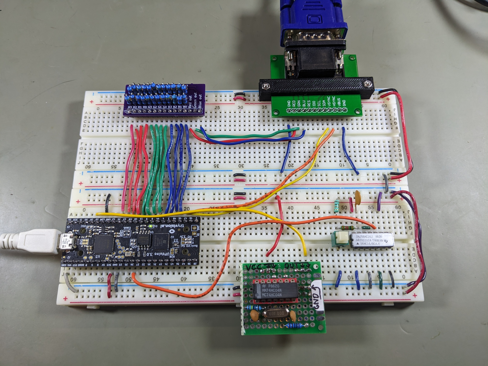
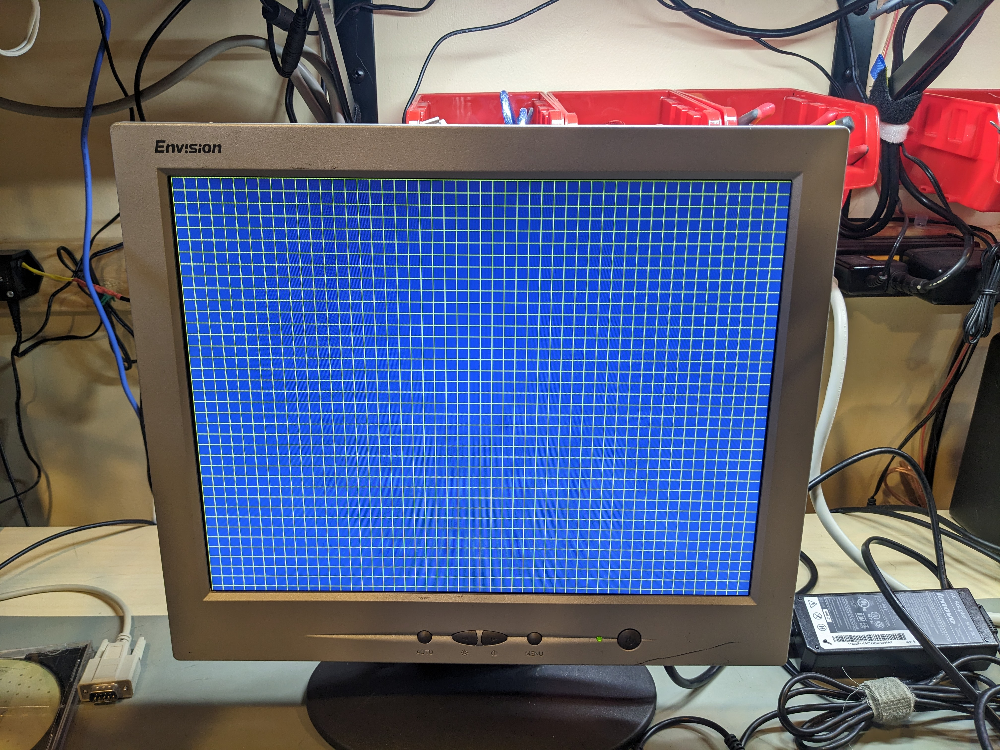

# icevga2: Another attempt at an ICE40-based 800x600 SVGA text mode display

This is a new effort to use an ICE40 device to implement a 100x37 text mode
display (using 800x600 SVGA video with 8x16 characters) for an 8 bit microcomputer.

I learned a lot in my previous effort to do this, and I think I know the
main things I did wrong in the previous effort. I also have an architecture
in mind that (I think!) should be feasible to implement.

I make no guarantees regarding if or when this project might be complete
enough to use. What I have now does output a correct video signal, and I'm
happy with the way sync and timing are handled.

## Hardware details

I'm using an Upduino 3.0 FGPA dev board with a resistor DAC which supports
4 bits of color signal for red/green/blue, so 4096 colors are possible.
I'm using an external 10 MHz oscillator, which feeds a PLL generating a
40 MHz clock internally. (This is the exact dot clock we need for
800x600 SVGA.)

## Programming

The Verilog code is built using [Icestorm](https://clifford.at/icestorm)
via the [APIO](https://github.com/FPGAwars/apio) front end.

To build and upload the design:

```
apio verify
apio build
apio upload
```

## Photos

The circuit (note that the pushbutton is for generating a debounced
reset signal):



Test display showing a grid (which demonstrates that the signal is putting
the correct pixels in the correct rows and columns):



## Progress Log

11/28/2023: Made the github project public and added more information
to the readme.

11/25/2023: Moved count, sync, and visibility signal generation to a
separate module ([timing\_gen.v](timing_gen.v)).

11/24/2023: Creation. Initial goal is to display a grid, with the goal of
having the pixels drawn exactly correspond to hcount/vcount values.
This does seem to be working!
